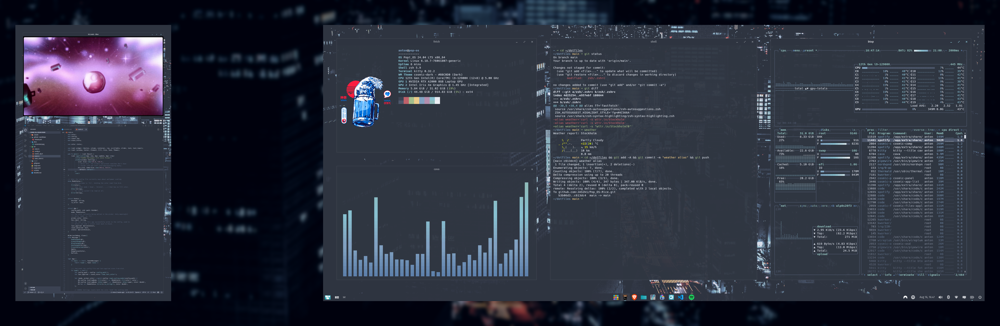

# Pop_OS-Rice

Nord-themed [COSMIC](https://system76.com/cosmic) desktop on Pop!_OS 24.04.



COSMIC Epoch 1 replaced GNOME entirely, so the usual ricing toolbox doesn't
apply — no GNOME Shell extensions, no GTK shell themes, no Kvantum, and no
Conky (COSMIC is Wayland-only). Theming happens through a `.ron` file and
COSMIC's own panel config instead.

Everything in this repo is desktop-environment agnostic, though: kitty, zsh,
btop, cava, and fastfetch run identically under KDE or GNOME.

---

## What's here

| Path | What it configures |
|---|---|
| `kitty/kitty.conf` | Terminal — Nord ANSI palette, Hack Nerd Font Mono |
| `zsh/.zshrc` | Shell — prompt with git branch, history search, plugins |
| `btop/btop.conf` | System monitor |
| `cava/config` | Audio visualizer, Nord gradient |
| `fastfetch/config.jsonc` | Fetch tool, image logo via kitty graphics protocol |
| `vscode/settings.json` | Editor |
| `gsettings-interface.ini` | GTK theme and font settings |
| `packages.txt` | Packages needed beyond a stock install |

---

## Install

```bash
git clone https://github.com/JAS2k1/Pop_OS-Rice.git ~/dotfiles
cd ~/dotfiles

sudo apt install kitty zsh zsh-autosuggestions zsh-syntax-highlighting \
                 btop cava adw-gtk3
```

fastfetch isn't packaged for Ubuntu 24.04 — grab the `.deb` from
[its releases page](https://github.com/fastfetch-cli/fastfetch/releases).

**Font:**

```bash
mkdir -p ~/.local/share/fonts && cd /tmp
curl -LO https://github.com/ryanoasis/nerd-fonts/releases/latest/download/Hack.zip
unzip -o Hack.zip -d ~/.local/share/fonts/Hack
fc-cache -f
```

**Symlinks:**

```bash
cd ~/dotfiles
mkdir -p ~/.config/{kitty,btop,fastfetch,cava}
ln -sf ~/dotfiles/kitty/kitty.conf       ~/.config/kitty/kitty.conf
ln -sf ~/dotfiles/zsh/.zshrc             ~/.zshrc
ln -sf ~/dotfiles/btop/btop.conf         ~/.config/btop/btop.conf
ln -sf ~/dotfiles/fastfetch/config.jsonc ~/.config/fastfetch/config.jsonc
ln -sf ~/dotfiles/cava/config            ~/.config/cava/config

chsh -s /usr/bin/zsh
```

Log out and back in for the shell change.

---

## COSMIC-specific setup

Not in this repo — panel geometry and display names are machine-specific.

1. **Theme** — Settings → Desktop → Appearance → Import, and load a Nord
   `.ron` from [cosmic-themes.org](https://cosmic-themes.org).
2. **Fonts** — Appearance → Experimental settings:
   system font `Fira Sans`, monospace `Hack Nerd Font Mono`.
3. **GTK apps** — Appearance → Icons and toolkit theming → enable
   *Apply current theme to GNOME apps*. Requires `adw-gtk3`.
4. **Panel** — bottom, extend to screen edges, dock disabled.
   Applets: workspaces + app library on the left wing, app list centered,
   status area and clock on the right.
5. **Window management** — gaps set to 15; that spacing is most of what
   makes the tiled layout read the way it does.

---

## Notes

- **`btop` theme** — press `Esc` → Options → Color theme → `nord`.
  Ships with btop, nothing to install.
- **`fastfetch` logo** — set `logo.source` in `config.jsonc` to your own
  image. `kitty-direct` uses kitty's graphics protocol, so the logo won't
  render in other terminals.
- **`cava`** — reads the PipeWire output stream, so it visualizes whatever
  is playing. No MPD daemon needed.
- **After editing `.zshrc`, run `exec zsh`, not `source`.** Sourcing only
  adds definitions; it never removes stale aliases from the running shell.

---

## Credits

- [Nord](https://www.nordtheme.com/) palette by Arctic Ice Studio
- [Nerd Fonts](https://www.nerdfonts.com/)
- [cosmic-utils](https://github.com/cosmic-utils) for third-party COSMIC applets
- Inspired by [this GNOME Pop!_OS rice](https://www.reddit.com/r/unixporn/comments/upqib5/gnome_popos_is_pretty_cool/)
